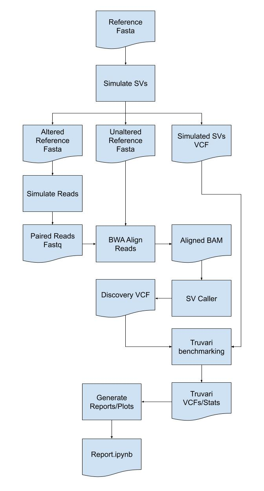

# SVTeaser


SV simulation for rapid benchmarking

[Previous Work](https://genomebiology.biomedcentral.com/articles/10.1186/s13059-015-0803-1)

[Hackathon Schedule](https://docs.google.com/document/d/1ychEMq4vXWtMQRGJD4re5ZzEyIDpb5o_cSBy3CPv2hg/edit#heading=h.5g50ovsn2k70)

[Presentation](https://docs.google.com/presentation/d/1tn9Yj5cRzizwnuOwf_PMNdAk46DuFlXUyILEEZ0GG-0/edit?usp=sharing)

## Introduction

SV detection callers often have a large number of false detections requiring benchmarking to assess method quality before finalizing a workflow. However, few tools are available to simulate data for SV benchmarking. SVTeaser is a tool for rapid assessment of structural variant (SV) calling fidelity with two main use-cases: 1) genotyping a set of pre-ascertained SVs and 2) benchmarking a new algorithm against pre-existing tools across a range of parameters. Users supply SVTeaser with a reference sequence file (.fasta) and, optionally, a set of SVs (.vcf). SVTeaser outputs simulated reads across a range of read lengths and depths and provides a downstream dataframe based analysis framework for evaluating accuracy. SVTeaser achieves rapid assessment by downsampling the full reference to a subset of numerous 10kb samples to which it adds SVs.


## Overview Diagram





## Working Notes/Documentation

[Here](https://docs.google.com/document/d/1AQxiYEbBhN0-HCAOsrqHZxvsh4ZIFxxeVoJGxApmG-U/edit#)


## Installation

- Build the SVTeaser pip install-able tarball
- Download and install [SURVIVOR](https://github.com/fritzsedlazeck/SURVIVOR.git)
- Put the `SURVIVOR` executable into your environment's PATH
- The three steps of this are handled by `bash install.sh`

- Install [vcftools](https://vcftools.github.io/index.html)
- Ensure `vcftools` (e.g. `vcf-sort`) is in your environment's PATH
- Put [ART read simulator](https://www.niehs.nih.gov/research/resources/software/biostatistics/art/index.cfm) executable into your environment's PATH
- Install [truvari](https://github.com/spiralgenetics/truvari)


## Quick Start

```
usage: svteaser [-h] CMD ...

SVTeaser v0.1 - SV read simulation for rapid benchmarking

    CMDs:
        known_sv        Create genome regions from a VCF of known SVs
        surv_sim        Simulate random SVs with SURVIVOR
        sim_reads       Run read simulators

positional arguments:
  CMD         Command to execute
  OPTIONS     Options to pass to the command

optional arguments:
  -h, --help  show this help message and exit
```

Workflow:

1. Create a SVTeaser working directory (`output.svt`) by simulating SVs over a reference
- `svteaser surv_sim reference.fasta workdir`
2. Simulate reads over the altered reference and place them in the `output.svt` directory
- `svteaser sim_reads workdir.svt`
3. Call SVs over the reads (`output.svt/read1.fastq output.svt/read2.fastq`) with your favorite SV caller
4. Run `truvari bench` with the `--base output.svt/simulated.sv.vcf.gz` and `--comp your_calls.vcf.gz`
5. Open the `notebooks/SVTeaser.ipynb` and point to your `output.svt` directory

See `test/workflow_test.sh` for an example

## Component Details

### SV Simulator
Two methods for SV simulation are supported in `SVTeaser` -

1. simulation of SV with `SURVIVOR` using the `surv_sim` option.
```
usage: surv_sim [-h] [--debug] [--sv_regions SV_REGIONS]
                [--num_sv_regions NUM_SV_REGIONS]
                [--len_sv_region LEN_SV_REGION]
                REF OUT

Run survivor simSV commands. Output them into a directory

positional arguments:
  REF                   Reference file overwhich to simulate SVs
  OUT                   SVTeaser output basename (output)

optional arguments:
  -h, --help            show this help message and exit
  --debug               Verbose logging
  --sv_regions SV_REGIONS
                        Comma separated file containing (chr, region_start,
                        region_end). For every row, an SV of length
                        randint(50, mx_variation) is generated with the region
                        specified by (chr, start, end). chr, start, end chr22,
                        1000, 20000 chr22, 50000, 80000
  --num_sv_regions NUM_SV_REGIONS
                        Alternatively to the csv file defined by --sv_regions,
                        user can also provide number of regions to generate
                        SVs for. The programme will randomly choose locations
                        within the genome to introduce the SVs. --sv_regions
                        will be given priority if both options are provided.
  --len_sv_region LEN_SV_REGION
                        The length of regions to create.
```
2. simulation of real SVs from user provided VCFs using the `known_sv` option.
```
usage: known_sv_sim [-h] [--debug] [--len_sv_region LEN_SV_REGION]
                    [--max_sv_size MAX_SV_SIZE]
                    [--ref_seq_padding REF_SEQ_PADDING]
                    REF SV_VCF OUT

Run simulation on reference with known SVs. Output them into a directory.

positional arguments:
  REF                   Reference file overwhich to simulate SVs
  SV_VCF                VCF with known SVs to simulate. MUST BE SORTED.
  OUT                   SVTeaser output basename (output)

optional arguments:
  -h, --help            show this help message and exit
  --debug               Verbose logging
  --len_sv_region LEN_SV_REGION
                        The length of regions to create.
  --max_sv_size MAX_SV_SIZE
                        Max length of variations to spike.
  --ref_seq_padding REF_SEQ_PADDING
                        Padded region around each end of reg where variation
                        are spiked.
```

Running simulation in either mode results in an output directory of the following structure -
```
$ svteaser surv_sim reference.fasta workdir
$ ll -h workdir.svt
total 2.3M
drwxr-xr-x  2 user hardware 4.0K Oct 12 15:38 ./
drwxr-xr-x 13 user hardware 4.0K Oct 12 15:38 ../
-rw-r--r--  1 user hardware 1.1M Oct 12 15:38 svteaser.altered.fa # <---- Multi-FASTA with all altered region sequences
-rw-r--r--  1 user hardware 980K Oct 12 15:38 svteaser.ref.fa     # <---- Multi-FASTA with all unaltered region sequences
-rw-r--r--  1 user hardware 228K Oct 12 15:38 svteaser.sim.vcf    # <---- Combined VCF with variants from each region
-rw-r--r--  1 user hardware  34K Oct 12 15:38 svteaser.sim.vcf.gz
-rw-r--r--  1 user hardware  121 Oct 12 15:38 svteaser.sim.vcf.gz.tbi
```

### Reads Simulator
Altered sequences are used to generate Illumina short-read using the follwing commands.

```
usage: sim_reads [-h] [--coverage COVERAGE] [--read-len READ_LEN]
                 [--mean-frag MEAN_FRAG] [--insert-sd INSERT_SD]
                 [--seq-inst SEQ_INST] [--keep-bam] [--out-dir OUT_DIR]
                 DIR

Run read simulators

positional arguments:
  DIR                   SVTeaser working directory

optional arguments:
  -h, --help            show this help message and exit
  --coverage COVERAGE   Depth of coverage to simulate (30)
  --read-len READ_LEN   Simulated read length (150)
  --mean-frag MEAN_FRAG
                        Mean insert fragment length (400)
  --insert-sd INSERT_SD
                        Insert fragment length standard deviation (50)
  --seq-inst SEQ_INST   Sequencing instrument (HS25)
  --keep-bam            Keep the simulated reads' sam/bam file
  --out-dir OUT_DIR     Output directory to save the results to. If
                        unspecified, will save the results at DIR
```